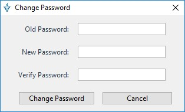

# Elementos de la aplicación
---
Vesta se encuentra distribuido en cuatro menús: 

- File
- Plugs-Ins
- Administration 
- Users.
 
Cada menú cuenta con funciones específicas y necesarias.

## Menú Users
---

En el menú Users se encuentran las configuraciones básicas sobre los usuarios:

1. Crear Usuarios
2. Mostrar los usuarios
3. Editar Perfiles
4. Cambiar Contraseña.

> Un usuario es la persona que tendrá acceso de la aplicación para su manipulación. 

### Add Users
---
En esta opción se pueden agregar usuarios. Un usuario debe estar asociado a un perfil, el perfil cuenta con permisos, por lo tanto, los permisos del perfil son los permisos que tendrá el usuario dentro de la aplicación.

Para crear el usuario se accede a:

**Click  Users > Add User**

Al ingresar a esta opción, se muestra la siguiente ventana en la cual se ingresan los datos:

- Login: Es el usuario de acceso al sistema
- Password: Contraseña de acceso al sistema. Esta contraseña deberá cumplir con los criterios de seguridad establecidos por la aplicación, pero se debe tener en cuenta que será cambiada al ingresar al sistema.
- Confirm password: volvemos a ingresar la contraseña.
- Profile: Define el perfil y con ello los permisos de acceso
- Name: Nombre descriptivo del usuario dentro del sistema.
- Comment: Comentarios adicionales.
- Change to the next logging in: Para cambiar el password en el siguiente acceso a la aplicación (por seguridad es obligatorio no editable)
- Save: una vez completa la información, se guarda.

> Nota: los criterios de seguridad son establecidos en el menú Administration > System Prameters

### Users 
---
En esta opción se muestran los usuarios de la aplicación y los que se hayan creado posteriormente.

**Click  Users > Users**

La siguiente pantalla permite visualizar los usuarios definidos dentro de la aplicación. Por default ya se encuentran definidos dos usuarios en el sistema, el usuario admin con todos los permisos y el usuario monitor limitado de permisos.  Si se crean otros usuarios, estos deben mostrarse en la ventana:

> Nota: Usuarios con el permiso “Edit User”, podrán modificar el password de otro usuario

### Profiles
---

Un perfil es una agrupación de permisos con funcionalidades específicas dentro de la aplicación.
Todos los usuarios deben estar asociados a un perfil, ya que este le permitirá manipular el sistema de acuerdo a los permisos otorgados por el perfil.

**Click  Users > Profiles**

La siguiente pantalla muestra los diferentes perfiles definidos dentro de la aplicación. Se pueden generar tantos perfiles como combinación de permisos sean necesarios.

A continuación se muestran los diferentes perfiles definidos dentro de la aplicación. Se pueden generar tantos perfiles como combinación de permisos sean necesarios.

El icono del signo **+** habilita un nuevo registro en modo edición permitiendo la captura de un nuevo perfil.

#### View Permissions
---

Cada “Perfil” cuenta con una serie de permisos que podrán ser listados seleccionando la opción “View permissions” del menú emergente.

En la siguiente pantalla se podrán seleccionar los permisos asociados a un Perfil.

Cada permiso otorga acceso a botones o funcionalidades específicas dentro de la aplicación y sobre los usuarios. Se debe ser cuidadoso en elegir el tipo de permisos que tendrá el perfil.

###Change Password
---

Es posible poder cambiar la contraseña del usuario una vez que se encuentre dentro de la aplicación. 

**Click  Users > Change password**

El usuario debe tener permisos para modificar el password de otro usuario. Ver sección de perfiles y permisos. El nuevo password debe cumplir las reglas de password según se indique en los parámetros de sistema. Ver sección de parámetros de sistema.

La siguiente pantalla permite modificar la contraseña de ingreso del usuario de manera personal. 

Al escribir la contraseña se deben considerar los parámetros establecidos en la opción <a href="#system-parameters"> System parameters </a> del menú Administration.

## Menú Administration

Dentro del menú Administración se encuentran tres opciones, la primera que permite ceder el control adquirido sobre las entradas, la segunda opción es de consulta sobre los accesos al sistema con los usuarios que han ingresado y por último se tiene la opción del sistema de parámetros generales de la aplicación.

### Release all entries
---

Una vez que se empieza hacer uso de la aplicación Vesta se va adquiriendo el control sobre las entradas de datos para poder manipularlos. 

Mediante esta opción puede el usuario liberar el control de todo lo que adquirió en la aplicación para que otro usuario pueda hacer uso de ella o simplemente Liberar todo el control sobre las entradas.

Una vez elegida la opción manda un cuadro de dialogo sobre la pantalla principal, preguntando si esta seguro de dejar el control de las entradas.

Elegimos la opción conveniente para dejar las entradas disponibles con la opción “Si” o bien, seguir con el control sobre ellas en la opción "No".

###Logs
---
Para tener un registro controlado de los acceso y manipulación de la aplicación, se cuenta con la opción “Log” que permite la consulta de los movimientos realizados

**Click Administration > Logs**

>Nota: Es posible realizar búsquedas específicas para encontrar información de manera más precisa.

***Búsqueda avanzada***

La siguiente pantalla permite visualizar el log de las acciones realizadas por los usuarios dentro de la aplicación, en ella se buscó el usuario admin y se muestran los resultados de las acciones realizadas:

 
Esta opción permite definir criterios de búsqueda específicos que agilicen la identificación de acciones dentro de la aplicación

### System Parameters
---
En esta opción se pueden manipular los parámetros de configuración de las contraseñas y definir cada cuanto tiempo se actualizará la información en la ventana de las entradas. 

**Click  administracion > system parameters**

La siguiente pantalla permite visualizar y modificar los parámetros de sistema.

*** Password Parameters ***

Donde se establecen las configuraciones de password tales como notificaciones de expiración, días de password válido y numero de passwords que no podrán ser repetidos.

*** Password rules ***

Establezca reglas de validación para establecer nuevos passwords como la longitud, mayúsculas, números y caracteres espaciales.

*** General parameters and visual parameters ***

En esta sección se establece cada cuantos segundos debe actualizarse la ventana donde se muestran las entradas de configuración. También se puede establecer el título de la aplicación para que se muestre en la “barra de título”.

Utilice el botón para guardar los cambios realizados en los Parámetros de sistema.

